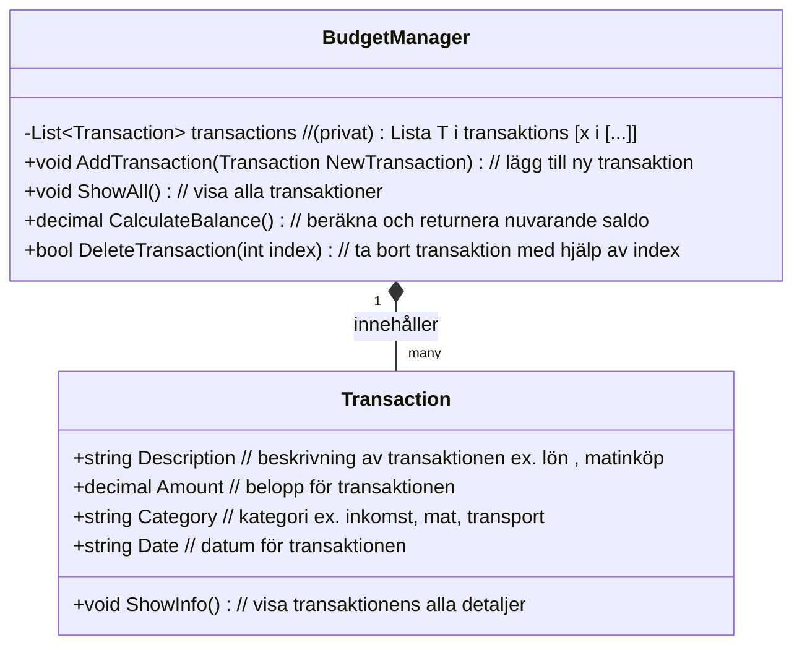

# Klassdiagram - Personal Budget Tracker

```mermaid

classDiagram
	class Transaction {
		+string Description // beskrivning av transaktionen ex. lön , matinköp
        +decimal Amount  // belopp för transaktionen
        +string Category // kategori ex. inkomst, mat, transport
        +string Date     // datum för transaktionen
        +void ShowInfo() // visa transaktionens alla detaljer
	}
	class BudgetManager {
		 -List~Transaction~ transactions // (privat) Lista T i transaktions [x i [...]]
        +void AddTransaction(Transaction NewTransaction) // lägg till ny transaktion
        +void ShowAll() // visa alla transaktioner
        +decimal CalculateBalance() // beräkna och returnera nuvarande saldo
        +bool DeleteTransaction(int index)  // ta bort transaktion med hjälp av index
	}

    BudgetManager "1" *-- "many" Transaction : innehåller
```
